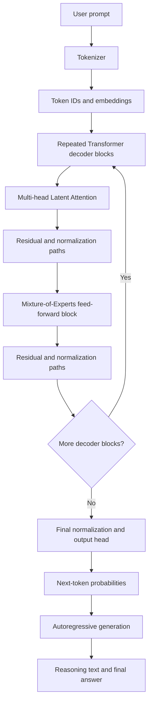
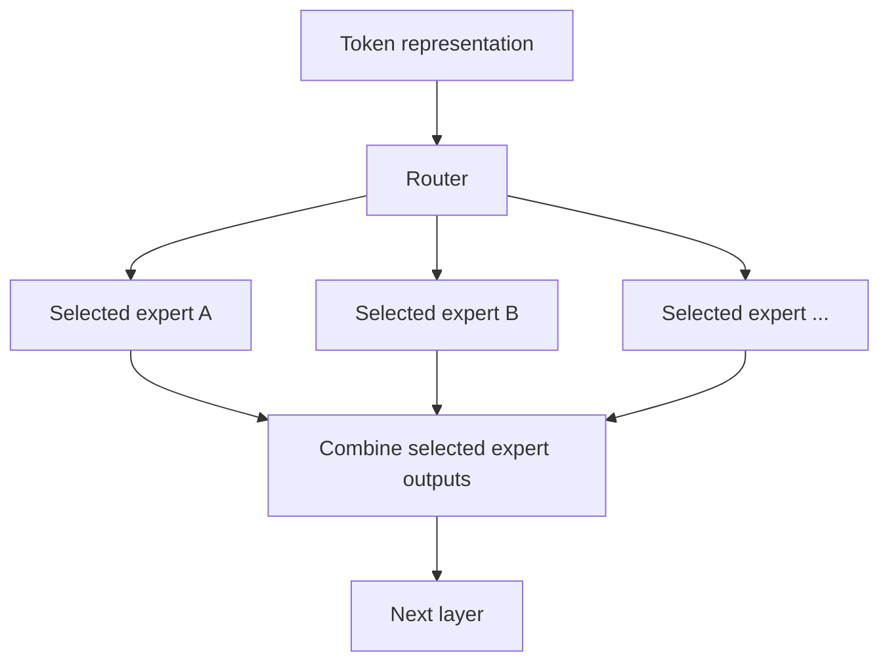
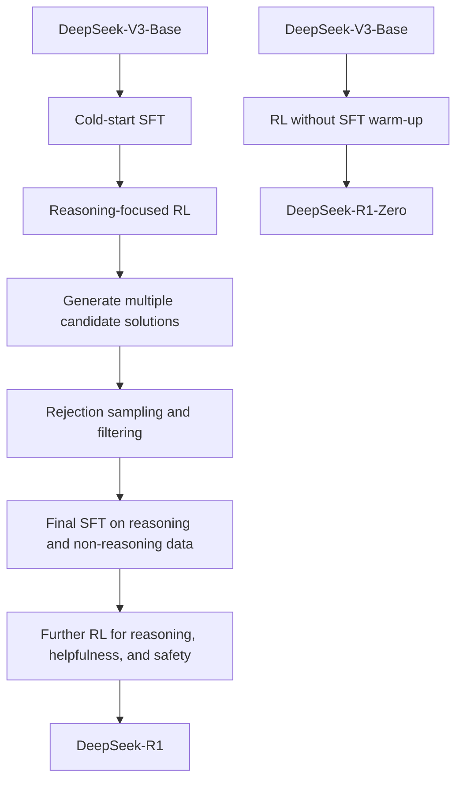

# DeepSeek From Scratch

> **An educational, from-scratch implementation of a DeepSeek-inspired language model with reasoning capabilities.**
>
> This repository studies the architecture and training ideas behind **DeepSeek-R1** and implements them at a scale that can be understood, tested, and iterated on by an individual developer.

**Project status:** In development — this README describes the research baseline and intended implementation roadmap. It does not imply that every component below has already been implemented.

DeepSeek-R1 is not a completely new neural-network backbone built from the ground up. The full-sized R1 and R1-Zero models are post-trained versions of **DeepSeek-V3-Base**. The main R1 contribution is its approach to incentivising reasoning with reinforcement learning (RL), then improving the model's usability with supervised fine-tuning (SFT), rejection sampling, preference-oriented RL, and distillation. The underlying V3 model contributes the large-scale Transformer architecture and efficiency innovations described below. [R1 paper](https://arxiv.org/abs/2501.12948) · [V3 technical report](https://arxiv.org/abs/2412.19437)

---

## Table of contents

- [Project vision](#project-vision)
- [DeepSeek-R1 at a glance](#deepseek-r1-at-a-glance)
- [Architecture: from prompt to response](#architecture-from-prompt-to-response)
- [The underlying DeepSeek-V3 architecture](#the-underlying-deepseek-v3-architecture)
  - [1. Decoder-only Transformer](#1-decoder-only-transformer)
  - [2. Mixture-of-Experts](#2-mixture-of-experts-moe)
  - [3. Multi-head Latent Attention](#3-multi-head-latent-attention-mla)
  - [4. RoPE and positional information](#4-rope-and-positional-information)
  - [5. Auxiliary-loss-free load balancing](#5-auxiliary-loss-free-load-balancing)
  - [6. Multi-Token Prediction](#6-multi-token-prediction-mtp)
  - [7. Training and systems efficiency](#7-training-and-systems-efficiency)
- [What DeepSeek-R1 advances](#what-deepseek-r1-advances)
  - [1. DeepSeek-R1-Zero: RL before SFT](#1-deepseek-r1-zero-rl-before-sft)
  - [2. Group Relative Policy Optimization](#2-group-relative-policy-optimization-grpo)
  - [3. Verifiable rewards](#3-verifiable-rewards)
  - [4. Emergent reasoning behaviours](#4-emergent-reasoning-behaviours)
  - [5. DeepSeek-R1: a multi-stage training pipeline](#5-deepseek-r1-a-multi-stage-training-pipeline)
  - [6. Distilling reasoning into smaller models](#6-distilling-reasoning-into-smaller-models)
- [R1-Zero vs R1](#r1-zero-vs-r1)
- [Architecture innovations vs reasoning innovations](#architecture-innovations-vs-reasoning-innovations)
- [Implementation roadmap](#implementation-roadmap)
- [Proposed repository structure](#proposed-repository-structure)
- [Evaluation plan](#evaluation-plan)
- [Limitations and engineering trade-offs](#limitations-and-engineering-trade-offs)
- [Learning resources and references](#learning-resources-and-references)
- [Disclaimer](#disclaimer)

---

## Project vision

The goal is to learn how a modern reasoning model works by implementing its important ideas as independent, testable components—not to copy a massive model configuration and treat it as a working implementation.

The project aims to:

1. **Understand the model backbone:** tokens, embeddings, Transformer blocks, attention, positional information, and language-model output probabilities.
2. **Explore efficiency:** a small Mixture-of-Experts (MoE) model, latent attention ideas, and optional multi-token prediction.
3. **Train reasoning behaviour:** build verifiers for tasks with objectively checkable answers and use those rewards to experiment with GRPO.
4. **Build a practical post-training pipeline:** cold-start SFT, RL, rejection sampling, final SFT, and preference/safety-oriented training experiments.
5. **Measure what improves:** evaluate correctness, reasoning-task performance, response format, latency, memory use, and inference cost.

### What “from scratch” means here

“From scratch” means implementing and understanding the relevant algorithms and model components ourselves, starting with a small model. It **does not** mean that a single developer can reproduce DeepSeek-R1's original 671-billion-parameter model, its pretraining data, or its distributed training run on a consumer laptop.

The full-scale R1 model is reported as **671B total parameters, with approximately 37B parameters activated per token**, and a **128K context length** in the official model summary. A smaller experimental model in this repository will be a learning implementation inspired by those ideas, not a reproduction with equivalent capability.

---

## DeepSeek-R1 at a glance

| Area | What it is | Why it matters |
|---|---|---|
| Base model | DeepSeek-V3-Base | Supplies the pretrained language knowledge and model backbone. |
| Backbone | Decoder-only Transformer using MLA and MoE | Predicts the next token while using a large parameter pool with sparse activation. |
| Main R1 training idea | Reinforcement learning to improve reasoning | Rewards better answers instead of relying only on demonstrations of how to reason. |
| RL algorithm | Group Relative Policy Optimization (GRPO) | Compares several answers to the same prompt and avoids a separate critic/value model used by conventional PPO setups. |
| Reward for verifiable reasoning | Rule-based correctness and format rewards | Mathematics answers can be checked; code can be run against tests. |
| R1-Zero | RL applied directly to the base model, without an SFT warm-up | Tests whether reasoning behaviour can emerge from RL without first copying human-written reasoning examples. |
| Full R1 pipeline | Cold-start SFT → RL → rejection sampling and SFT → further RL | Improves reasoning while addressing readability, language consistency, helpfulness, and safety. |
| Distillation | SFT smaller Qwen- and Llama-family models on R1-generated examples | Transfers useful reasoning patterns to models that are more practical to run. |

**Important distinction:** GRPO and the R1 multi-stage reasoning pipeline are central to the R1 story. MLA, MoE, auxiliary-loss-free load balancing, and MTP are innovations in the **V3 backbone/training system** inherited by R1, rather than inventions introduced specifically by R1. [R1 paper](https://arxiv.org/abs/2501.12948) · [V3 report](https://arxiv.org/abs/2412.19437)

---

## Architecture: from prompt to response

The following diagram is a conceptual view of the full-sized R1 model. It is not a layer-by-layer reproduction of every implementation detail.



At a high level, the model still generates text **one token at a time**. The architecture determines how the model computes its next-token distribution. The training process determines which continuations it learns to prefer. R1's reasoning improvements came primarily from post-training, rather than from replacing the Transformer with an entirely different architecture.

---

## The underlying DeepSeek-V3 architecture

### 1. Decoder-only Transformer

A decoder-only Transformer takes a sequence of tokens and predicts what token is likely to come next. Causal attention prevents a position from attending to future tokens that have not yet been generated.

A simplified block contains:

- **Token embeddings:** convert token IDs into vectors.
- **Attention:** lets each token use information from earlier tokens in the sequence.
- **Feed-forward network:** applies additional transformations to each token representation. DeepSeek-V3 uses MoE blocks in place of a standard dense feed-forward network in most of its architecture.
- **Residual connections and normalization:** help information and gradients move through many layers.
- **Output projection:** converts the final representation into scores (logits) for the vocabulary.

The next-token training objective teaches the model to predict text from context. This creates a pretrained base model, but a pretrained model is not automatically a helpful assistant or a strong deliberate reasoner. Those behaviours are shaped further during post-training.

### 2. Mixture-of-Experts (MoE)

A conventional **dense** feed-forward layer applies the same feed-forward network to every token. A Mixture-of-Experts layer contains several expert networks and a router that selects a subset of experts for each token.

Think of the experts as specialist teams. A router chooses which teams should process a particular token, rather than asking every team to process every token.



**Why use MoE?** It enables a model to hold a very large number of parameters while activating only a subset of its experts for a particular token. This reduces per-token computation compared with activating an equivalently sized dense network, although total weight storage, routing, and expert-to-expert communication remain expensive.

**DeepSeek's MoE approach:** DeepSeekMoE uses routed experts and shared-expert capacity. Routing is learned, so experts may develop different specialisations; these are not guaranteed to be clean human-defined categories. The full V3 model has 671B total parameters and about 37B active per token. “Active parameters” does not mean the remaining parameters take no memory: the full collection of weights still has to be stored or distributed across the serving system.

**Implementation note for this repository:** start with a small top-*k* router and a handful of small experts. Test routing, load balance, gradients, and output shapes before increasing expert count. A toy MoE is useful for learning, but it does not reproduce DeepSeek's scale or distributed routing system.

### 3. Multi-head Latent Attention (MLA)

In ordinary multi-head attention, a model commonly caches key and value vectors for past tokens so that it does not have to recompute them at every generation step. For long contexts, this **KV cache** can consume a large amount of accelerator memory.

**Multi-head Latent Attention (MLA)** reduces this cost by compressing key/value information into a smaller latent representation and reconstructing the required representations for attention. DeepSeek's design also handles positional information separately through a decoupled use of rotary position embeddings.

| Ordinary attention concept | MLA idea | Intended benefit |
|---|---|---|
| Store key/value vectors for past tokens | Store a compact latent representation for key/value information | Reduce KV-cache memory |
| Cache size grows with context length and attention dimensions | Smaller cached representation per token | Make long-context inference more memory-efficient |
| Position information is integrated into attention representations | Decoupled positional component is used in the MLA design | Preserve positional information while using compressed latent states |

**Trade-off:** MLA is not a free drop-in simplification. It adds architectural details and requires careful implementation of projections, positional components, caching, and inference kernels. It is best treated as an advanced milestone after a correct baseline attention implementation exists.

### 4. RoPE and positional information

Self-attention alone does not inherently encode the order of words. **Rotary Position Embeddings (RoPE)** inject position-dependent rotations into query/key representations, allowing attention to use information about token positions.

RoPE is not an innovation unique to DeepSeek-R1. It is part of the broader Transformer design landscape. In the DeepSeek-V3 MLA design, positional information is handled using a decoupled RoPE component so that compressed key/value representations and positional encoding can work together.

For this project, implement and test a standard RoPE path first. Only then explore the specific positional design used with MLA.

### 5. Auxiliary-loss-free load balancing

MoE routers can send too many tokens to a small number of experts. This creates overloaded experts, inefficient use of the expert pool, and communication bottlenecks. Many MoE designs use an auxiliary load-balancing loss to encourage more even routing, but the additional objective can interfere with the main language-model objective.

DeepSeek-V3 introduces an **auxiliary-loss-free load-balancing strategy** that adjusts expert-selection biases to improve routing balance without relying on the conventional token-level auxiliary loss as the main balancing mechanism. The report also describes additional safeguards, including a complementary sequence-wise auxiliary loss. Therefore, “auxiliary-loss-free” should not be interpreted as “there are no auxiliary losses or routing safeguards anywhere in training.”

For a small implementation, measure:

- Tokens routed to each expert.
- Expert utilisation and routing entropy.
- Whether a few experts receive most tokens.
- Training stability and task quality as routing balance changes.

A balanced router is not automatically a better router: load balancing must be considered alongside language-model quality.

### 6. Multi-Token Prediction (MTP)

Standard autoregressive training asks a language model to predict the next token. **Multi-Token Prediction** adds auxiliary prediction targets for subsequent future tokens during training. This provides extra learning signals about upcoming text and can improve the learned representations.

MTP also has a possible inference benefit: compatible draft predictions can support **speculative decoding**, where a faster draft path proposes tokens and a larger model verifies them. Real speed-ups depend on the implementation, hardware, serving framework, and acceptance rate of draft tokens.

MTP is a DeepSeek-V3 training/architecture feature, not the core R1 reinforcement-learning breakthrough. It is an advanced extension for this repository, after standard next-token training and evaluation work correctly.

### 7. Training and systems efficiency

DeepSeek-V3's reported results came from architecture choices **and** large-scale systems engineering. The V3 technical report describes, among other things:

- **FP8 mixed-precision training:** uses lower-precision numerical formats for parts of training to reduce memory and computation costs, with care taken to preserve numerical stability.
- **Parallel MoE execution:** distributes experts and computation across accelerator devices.
- **Communication/computation overlap:** schedules communication so more of it can occur while useful computation is running.
- **Memory optimisation:** reduces the memory footprint of training operations.
- **Large-scale pretraining:** the V3 report describes training on 14.8 trillion tokens and reports approximately 2.788 million H800 GPU-hours for pretraining, context extension, and post-training combined under its stated accounting assumptions.

These are not features that a small local implementation can reproduce simply by enabling a flag. They rely on specialised kernels, distributed infrastructure, large datasets, and substantial hardware resources. They belong in the research background and longer-term roadmap, not in claims that a laptop-scale version matches the full-size model.

---

## What DeepSeek-R1 advances

### 1. DeepSeek-R1-Zero: RL before SFT

The conventional assistant-training path often begins with **Supervised Fine-Tuning (SFT)**: show the model examples of desirable responses and train it to imitate them. Reinforcement learning is then used to improve behaviour against a reward signal.

DeepSeek-R1-Zero tests a different path. It applies large-scale reinforcement learning directly to DeepSeek-V3-Base **without first performing an SFT warm-up**. The model is given reasoning prompts and reward feedback, then trained to make responses with higher rewards more likely.

The R1 paper reports the emergence of behaviours including:

- Longer multi-step solution attempts.
- Revisiting earlier steps and correcting mistakes.
- Checking intermediate conclusions or final answers.
- Exploring alternative approaches before settling on an answer.

These behaviours are observed training outcomes, not guaranteed properties of every answer. Longer reasoning traces can still contain mistakes, repeat themselves, or follow an incorrect path.

#### Why it mattered

R1-Zero is evidence that, on tasks with a sufficiently reliable reward signal, useful reasoning behaviour can be encouraged through RL without first supplying a large curated dataset of human-written reasoning traces. It does **not** mean that all reasoning data, all pretraining, or all human guidance can be removed from every model-training pipeline.

### 2. Group Relative Policy Optimization (GRPO)

GRPO is the reinforcement-learning algorithm used in the R1 training pipeline. It was designed as a more resource-efficient alternative to common PPO setups for LLM training.

A simplified GRPO iteration looks like this:

1. Take one prompt, such as a mathematics or programming problem.
2. Generate a **group of candidate responses** for that same prompt.
3. Score each response with a reward function or verifier.
4. Compare each score with the group's scores. A response that scores above the group average receives a more positive relative advantage; a below-average response receives a lower one.
5. Update the model to favour better-scoring responses, while clipping overly large policy updates and regularising drift from a reference policy.
6. Repeat with new prompts and generated groups.

A simplified group-relative advantage is:

\[
A_i = \frac{r_i - \operatorname{mean}(r_1,\ldots,r_G)}{\operatorname{std}(r_1,\ldots,r_G)}
\]

where \(r_i\) is the reward for response \(i\), and \(G\) is the number of sampled responses in the group. This formula is a conceptual summary; a faithful training implementation must also account for token-level policy ratios, clipping, reference-policy regularisation, masking, and the details of the loss.

**The key difference from typical PPO setups:** GRPO estimates relative advantages from a group of sampled outputs instead of training a separate value/critic model to estimate them. This can reduce memory and training overhead for very large models.

**What GRPO does not do:** it does not automatically know whether an answer is correct. The quality of learning depends heavily on the reward signal, the sampled responses, and the stability of the optimisation process.

Reference: [DeepSeek-R1 paper](https://arxiv.org/abs/2501.12948) and [DeepSeekMath / GRPO paper](https://arxiv.org/abs/2402.03300).

### 3. Verifiable rewards

For tasks with objectively checkable outputs, a program can score answers more consistently than a general-purpose learned preference model. In R1-Zero's reasoning RL, the paper describes two main rule-based rewards:

| Reward | What it checks | Example |
|---|---|---|
| Accuracy reward | Whether the result is correct | Compare a math answer with a verified answer, or run code against unit tests. |
| Format reward | Whether the response follows the expected structure | Require the reasoning and final answer to appear in the prescribed format. |

For these reasoning tasks, the R1-Zero paper deliberately avoids a neural reward model, noting the risks of reward hacking and the extra complexity of training and maintaining another model. The full R1 pipeline later uses model-based reward signals for general helpfulness and safety-oriented objectives, while continuing to use rule-based rewards for verifiable reasoning problems.

This suggests an important implementation principle: use the strongest practical verifier available for the task. For code, sandboxed tests are more meaningful than asking another language model whether the code looks correct. For mathematics, robust parsing and symbolic or numerical checks are preferable when available.

**Reward-design warning:** a model optimises the signal it receives, not the intention you had in mind. A weak verifier can reward incorrect shortcuts, brittle formatting, or other forms of reward hacking.

### 4. Emergent reasoning behaviours

The R1 paper describes the model developing more extended response strategies as RL training progresses. Its examples include reflection, re-evaluation, verification, and exploration of alternatives. The paper calls attention to an “aha” moment in which the model starts revisiting its previous reasoning during generation.

For this project, these should be measured as behaviours, rather than assumed to prove that the model is always reasoning correctly. Useful experiments include:

- Compare response length before and after RL.
- Measure pass rate on held-out questions with known answers.
- Track how often a response changes its conclusion and whether the correction is actually right.
- Compare single-sample accuracy with multi-sample majority-vote or best-of-*n* evaluation.
- Record repeated text, malformed output, language mixing, and verifier exploitation.

More tokens can improve the chance of finding a correct solution, but they also add latency and inference cost. Test-time compute must be evaluated against accuracy, not treated as an unconditional improvement.

### 5. DeepSeek-R1: a multi-stage training pipeline

R1-Zero showed the potential of RL-driven reasoning, but its outputs could be difficult to read, mix languages, and underperform on broader assistant tasks such as general writing and open-domain questions. DeepSeek-R1 adds a structured pipeline to address these weaknesses.



The two branches are related but distinct. R1-Zero is the direct-RL experiment; the R1 path uses a cold start and multiple further training stages.

#### Stage 1 — Cold-start data and SFT

A relatively small set of carefully curated examples demonstrates a more conversational, readable reasoning style. These examples are used to seed the model before RL. This gives later training a stronger starting point for producing structured reasoning without requiring the entire reasoning behaviour to be prescribed in advance.

#### Stage 2 — Reasoning-focused RL

RL improves the model on problems where reward can be checked, especially mathematics, coding, and logic. The R1 paper also describes a language-consistency reward to reduce unwanted mixing of languages in outputs.

#### Stage 3 — Rejection sampling and final SFT

The model generates multiple candidate solutions for prompts. Candidates that pass correctness checks or quality filters are retained, while poor responses are rejected. The selected data is combined with non-reasoning tasks such as writing, factual question answering, translation, and other assistant behaviours, then used for SFT.

The R1 paper describes approximately **600,000 reasoning-related samples** and **200,000 non-reasoning samples**, totalling about **800,000 SFT examples**. These figures describe the paper's training pipeline; they are not a requirement or a guaranteed target for this repository.

#### Stage 4 — Further RL for overall assistant quality

A second RL stage further improves reasoning and aligns general responses with human preferences for helpfulness and harmlessness. For verifiable reasoning, the pipeline continues to use rule-based rewards. For general queries, it uses learned reward models alongside format and language-consistency signals.

The main lesson is that reasoning quality and assistant usability are related but different targets. A model can improve at competition-style mathematics while still needing additional training to write clearly, follow instructions, handle ordinary questions, or refuse unsafe requests appropriately.

### 6. Distilling reasoning into smaller models

The full R1 model is too large for ordinary single-device use. DeepSeek therefore released smaller dense models fine-tuned on examples generated by R1, using Qwen- and Llama-family base models.

**Knowledge distillation**, in this context, means training a smaller student model on high-quality examples produced by a stronger teacher. The student learns from the teacher's generated input/output examples, including reasoning-style responses, instead of having to rediscover every useful behaviour through its own large-scale RL run.

The official release includes models in the 1.5B, 7B, 8B, 14B, 32B, and 70B parameter ranges. The R1 paper's reported distilled models were trained with SFT, without an additional RL stage in that particular demonstration.

**Why it matters:** the paper finds that distilling strong R1 outputs can outperform applying RL alone to a smaller model. Distillation is therefore a practical route for experimenting with reasoning on limited hardware, even though a distilled model does not become identical to its teacher and can still inherit limitations from generated training data.

Official list: [DeepSeek-R1 repository](https://github.com/deepseek-ai/DeepSeek-R1).

---

## R1-Zero vs R1

| Dimension | DeepSeek-R1-Zero | DeepSeek-R1 |
|---|---|---|
| Starting checkpoint | DeepSeek-V3-Base | DeepSeek-V3-Base, with a staged training pipeline |
| SFT before the first RL stage | No | Yes, using cold-start examples |
| Reasoning RL | Yes, central to the experiment | Yes, followed by further post-training |
| Reasoning reward | Primarily rule-based accuracy and formatting rewards | Rule-based reasoning rewards plus model-based signals for general assistant behaviour |
| Readability and language consistency | Can be weak; language mixing and repetition may occur | Explicitly improved through cold-start examples, filtering, language-consistency rewards, SFT, and further RL |
| Broader assistant behaviour | More limited when training focuses on verifiable reasoning | Additional non-reasoning data and preference-oriented training support general helpfulness and safety |
| What the experiment demonstrates | Reasoning patterns can emerge from RL without an SFT warm-up | A multi-stage pipeline can combine reasoning gains with more usable assistant behaviour |

---

## Architecture innovations vs reasoning innovations

A frequent source of confusion is mixing the architecture of the underlying model with the method used to train it to reason.

| Technique | Primarily associated with | Category | Main purpose |
|---|---|---|---|
| Decoder-only Transformer | V3 base and R1 | Model architecture | Next-token language modelling with causal attention |
| Mixture-of-Experts (MoE) | DeepSeek-V3 | Sparse model architecture | Large parameter capacity with only a subset of experts active per token |
| Multi-head Latent Attention (MLA) | DeepSeek-V2/V3 lineage | Attention architecture | Reduce KV-cache memory through latent compression |
| RoPE / decoupled positional component | Transformer / V3 MLA design | Positional handling | Represent token position in attention |
| Auxiliary-loss-free load balancing | DeepSeek-V3 | Routing and training strategy | Improve MoE expert utilisation while reducing interference from a conventional balancing loss |
| Multi-Token Prediction (MTP) | DeepSeek-V3 | Training objective / optional inference support | Add future-token prediction signals and enable compatible speculative-decoding approaches |
| GRPO | R1 post-training | RL optimisation | Improve response quality using relative rewards from multiple outputs per prompt |
| Rule-based accuracy and format rewards | R1-Zero reasoning RL | Reward design | Provide concrete feedback for tasks that can be checked automatically |
| Cold-start SFT and rejection sampling | DeepSeek-R1 | Data and post-training pipeline | Improve the starting response style and create filtered SFT examples |
| Helpful/safety preference rewards | DeepSeek-R1 final RL stages | Alignment | Improve general-purpose assistant behaviour |
| Distillation from R1 outputs | R1-Distill models | Knowledge transfer | Transfer useful reasoning patterns to smaller dense models |

In short: **MLA and MoE influence how the model computes; GRPO and the R1 training pipeline influence which responses the model learns to produce.**

---

## Implementation roadmap

This roadmap is designed to keep each component small enough to test before moving on. The order can change as implementation experience grows.

### Phase 1 — A working language-model baseline

- Build a tokenizer/data pipeline and a small decoder-only Transformer.
- Implement token embeddings, causal attention, feed-forward layers, normalization, residual connections, and the output head.
- Train with next-token cross-entropy on a small, licensed dataset.
- Add checkpoint saving/loading, deterministic validation, and a simple generation loop.
- **Acceptance checks:** loss decreases, tensor shapes are tested, checkpoints reload, generation works, and validation data is separated from training data.

### Phase 2 — Positional encoding and attention improvements

- Implement RoPE and unit tests for position handling.
- Record attention memory use and generation latency at several context lengths.
- Study MLA equations and build a separate experimental implementation if the baseline is stable.
- **Acceptance checks:** positions affect attention as expected, cached and uncached inference agree within numerical tolerance, and memory measurements are recorded.

### Phase 3 — A small MoE layer

- Build a learned router and a configurable set of feed-forward experts.
- Implement top-*k* routing and combine expert outputs correctly.
- Log tokens-per-expert, router probabilities, expert utilisation, and training stability.
- Compare a dense baseline with a parameter-matched or compute-aware MoE experiment.
- **Acceptance checks:** gradients reach selected experts and router parameters; routing statistics and load-balance metrics are tested.

### Phase 4 — Multi-Token Prediction (stretch goal)

- Add auxiliary heads/blocks that predict future tokens at more than one offset.
- Define the combined loss and mask positions without valid future targets.
- Measure whether the auxiliary objective improves held-out next-token or downstream task performance.
- Treat speculative decoding as a separate inference project, not an automatic benefit of adding MTP.

### Phase 5 — Build verifiers before reinforcement learning

- Start with a small set of mathematics or algorithmic coding problems with known answers.
- Implement safe answer extraction and a deterministic correctness checker where possible.
- For coding, run tests inside an isolated sandbox with resource limits; do not execute arbitrary model-generated code on the host.
- Add formatting checks and log failure cases.
- **Acceptance checks:** manually audited reward examples, tests for false positives/negatives, and a held-out evaluation set.

### Phase 6 — Implement a small GRPO experiment

- Sample several responses for each prompt from the current policy.
- Calculate rewards and group-relative advantages.
- Implement policy-ratio clipping and reference-policy KL regularisation, with careful masking of prompt versus response tokens.
- Track reward, task accuracy, response length, entropy, KL divergence, gradient norms, and generated samples.
- Compare against supervised fine-tuning and a simple baseline before drawing conclusions.
- Begin with a tiny model and short sequences. GRPO is memory- and compute-intensive even at small scales because each prompt requires multiple generated responses.

### Phase 7 — R1-style multi-stage post-training

- Curate a modest cold-start dataset for structured, readable responses.
- Run reasoning-oriented RL on tasks with reliable verifiers.
- Generate multiple candidate responses and keep only those that meet correctness and quality rules.
- Fine-tune on filtered reasoning samples plus general instruction data.
- If appropriate data and evaluation criteria are available, experiment with a separate preference/safety reward stage.
- Evaluate helpfulness and safety separately from verifiable reasoning accuracy.

### Phase 8 — Distillation and deployment experiments

- Use a stronger available teacher or a model-generated dataset to create a small student SFT corpus.
- Compare the student trained on distilled examples with the same student trained on ordinary supervised data.
- Benchmark quantized and non-quantized inference, context length, memory use, throughput, and latency.
- Document which behaviours transfer and which do not.

**Priority recommendation:** make the small Transformer, task verifiers, and one reproducible GRPO experiment work before investing heavily in MLA, MTP, custom low-precision kernels, or distributed MoE. Correctness and useful measurements are more valuable than implementing every advanced feature at once.

---

## Proposed repository structure

The layout below is a proposal and can be adjusted to match the actual code as the repository develops.

```text
DeepSeek-From-Scratch/
├── README.md
├── pyproject.toml
├── configs/
│   ├── model.yaml
│   ├── pretraining.yaml
│   └── grpo.yaml
├── docs/
│   ├── architecture.md
│   ├── training_pipeline.md
│   └── experiments.md
├── data/
│   └── README.md              # Dataset instructions; avoid committing large/private datasets
├── src/
│   └── deepseek_scratch/
│       ├── tokenization/
│       ├── model/
│       │   ├── transformer.py
│       │   ├── attention.py
│       │   ├── rope.py
│       │   ├── mla.py
│       │   └── moe.py
│       ├── training/
│       │   ├── pretrain.py
│       │   ├── sft.py
│       │   └── grpo.py
│       ├── rewards/
│       │   ├── math_verifier.py
│       │   ├── code_verifier.py
│       │   └── format_reward.py
│       ├── distillation/
│       └── inference/
├── tests/
│   ├── test_attention.py
│   ├── test_rope.py
│   ├── test_moe.py
│   ├── test_rewards.py
│   └── test_grpo_math.py
├── scripts/
└── outputs/                   # Local checkpoints/logs; normally excluded from Git
```

Keep downloaded datasets, model checkpoints, logs, credentials, and private training examples out of version control unless there is a clear reason and the relevant licence and privacy requirements permit them.

---

## Evaluation plan

Reasoning models can appear better simply because they generate more tokens or because an evaluator is too easy to exploit. Evaluation should make those risks visible.

| Dimension | What to measure | Why |
|---|---|---|
| Language-model baseline | Validation loss / perplexity | Confirms that pretraining is learning a useful next-token distribution |
| Reasoning accuracy | Exact-match or verifier pass rate on held-out math/code tasks | Measures whether answers are correct, not merely long |
| Sample efficiency | Pass@1 and, where relevant, best-of-*n* or majority-vote accuracy | Separates single-response quality from gains due to sampling more answers |
| Reward quality | Agreement with manually audited labels; false-positive reward rate | Detects reward hacking and faulty verifiers |
| Reasoning behaviour | Response length, repetition, self-correction frequency, and correctness after correction | Tracks behaviour without assuming that longer chains are better |
| General assistant quality | Instruction following, writing, factual QA, and language consistency | Checks for regressions caused by reasoning-focused RL |
| Safety | Results on an explicitly defined safety evaluation set | Measures safety separately from task accuracy |
| Efficiency | Peak GPU memory, tokens/second, time-to-train, and inference latency | Makes comparisons meaningful on limited hardware |
| Stability | Loss curves, gradient norms, KL divergence, and expert load | Helps diagnose optimisation collapse or routing imbalance |

Use held-out problems and avoid tuning repeatedly against the same benchmark. Report model size, training data, number of samples, decoding settings, and evaluation method with every benchmark result.

---

## Limitations and engineering trade-offs

- **Reasoning is not guaranteed to be correct.** Reflection-like language can be persuasive and still lead to an incorrect result.
- **RL depends on reward quality.** Incorrect reference answers, weak unit tests, or biased learned reward models can teach the wrong behaviour.
- **Long reasoning costs more.** More generated tokens increase latency and inference expense; test-time scaling needs to demonstrate a measurable benefit.
- **MoE is not cheap just because fewer parameters are active.** The full expert weights occupy memory, and routing introduces communication and serving complexity.
- **MLA is implementation-sensitive.** Its memory advantages depend on faithful attention and KV-cache implementation, not just naming a module “MLA.”
- **Distillation transfers behaviours imperfectly.** A small student can be strong on selected tasks but will not necessarily match the teacher's knowledge, robustness, or range.
- **Large-scale reproduction is out of scope for a typical workstation.** Full R1-scale training requires massive data, distributed accelerators, infrastructure, and systems expertise. This project should be evaluated as a learning implementation unless it actually reproduces those conditions.

---

## Learning resources and references

These original and official sources should be treated as the primary references for the explanations above.

1. **DeepSeek-R1: Incentivizing Reasoning Capability in LLMs via Reinforcement Learning** — [arXiv paper](https://arxiv.org/abs/2501.12948) · [official GitHub repository](https://github.com/deepseek-ai/DeepSeek-R1)
2. **DeepSeek-V3 Technical Report** — [arXiv paper](https://arxiv.org/abs/2412.19437) · [official GitHub repository](https://github.com/deepseek-ai/DeepSeek-V3)
3. **DeepSeekMath: Pushing the Limits of Mathematical Reasoning in Open Language Models** — introduces GRPO in the DeepSeekMath training context: [arXiv paper](https://arxiv.org/abs/2402.03300)
4. **DeepSeek-V2: A Strong, Economical, and Efficient Mixture-of-Experts Language Model** — background for MLA and DeepSeekMoE: [arXiv paper](https://arxiv.org/abs/2405.04434)

When reporting an implementation choice, distinguish between a fact documented in a paper, a simplified educational approximation, and a design decision made for this repository.

---

## Disclaimer

This is an independent educational project. It is **not an official DeepSeek project**, and it does not claim to reproduce the complete DeepSeek-R1 model or its training run. “DeepSeek” and related model names are used here to identify the research work being studied. Review the licence of each upstream model, dataset, library, or checkpoint before using it; licences may differ across base models and derivative models.

---

*Built to learn the architecture, reproduce the core ideas at small scale, measure the results, and document the gaps honestly.*
